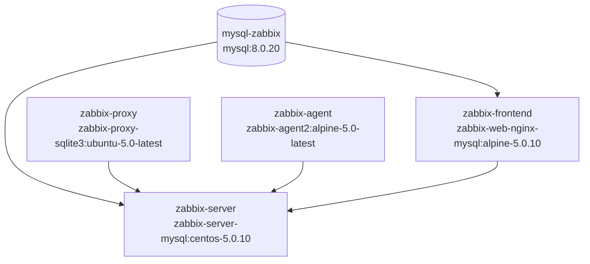
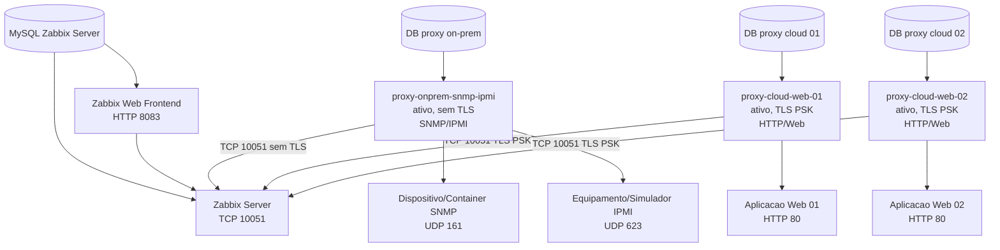

# 01 - Planejamento

## Objetivo

Planejar a evolucao do ambiente Zabbix fornecido pelo professor para uma topologia com tres Zabbix Proxies ativos:

- `proxy-onprem-snmp-ipmi`: ambiente on-premises, sem TLS com o servidor, dedicado a SNMP/IPMI.
- `proxy-cloud-web-01`: ambiente cloud simulado, com TLS PSK, dedicado a HTTP Agent e cenarios Web.
- `proxy-cloud-web-02`: ambiente cloud simulado, com TLS PSK, dedicado a HTTP Agent e cenarios Web.

Esta fase e apenas de inspecao e planejamento. Nenhum arquivo original do professor foi substituido.

## Estrutura encontrada

```text
.
|-- contexto.md
|-- docker-compose-zabbix50.yaml
`-- envs/
    |-- zabbix-agent/
    |   `-- zabbix50.env
    |-- zabbix-frontend/
    |   |-- common.env
    |   `-- zabbix50.env
    |-- zabbix-proxy/
    |   |-- common.env
    |   `-- zabbix50.env
    `-- zabbix-server/
        |-- common.env
        `-- zabbix50.env
```

Observacao: o arquivo solicitado como `contexto.mc` nao existe no diretorio. O arquivo encontrado e lido foi `contexto.md`.

## Versao e imagens

O arquivo `docker-compose-zabbix50.yaml` indica Zabbix 5.0.10 para servidor e frontend:

| Componente | Imagem atual |
|---|---|
| Banco de dados | `mysql:8.0.20` |
| Zabbix Server | `zabbix/zabbix-server-mysql:centos-5.0.10` |
| Zabbix Web Frontend | `zabbix/zabbix-web-nginx-mysql:alpine-5.0.10` |
| Zabbix Proxy | `zabbix/zabbix-proxy-sqlite3:ubuntu-5.0-latest` |
| Zabbix Agent | `zabbix/zabbix-agent2:alpine-5.0-latest` |

Ponto de atencao: o proxy usa tag `5.0-latest`, nao `5.0.10`. Para reprodutibilidade, a Fase 3 deve avaliar fixar a tag em uma versao especifica compativel com o servidor.

## Arquitetura atual



Todos os servicos estao na rede externa `monitoring-network`.

## Arquitetura proposta



## Funcionamento do projeto atual

O projeto sobe um ambiente Zabbix basico com banco MySQL, Zabbix Server, frontend Nginx, proxies SQLite e um agent2. O frontend e publicado na porta `8083` do host e o servidor Zabbix na porta `10151` do host, mapeada para `10051` no container.

Os arquivos `.env` configuram parametros do Zabbix por variaveis com prefixo `ZBX_`, alem de variaveis do MySQL. Segundo a documentacao oficial dos containers Zabbix, variaveis de componente correspondem a parametros dos arquivos de configuracao com outro padrao de nome, por exemplo `ZBX_SERVER_HOST` para `Server`.

## Portas e protocolos

| Uso | Protocolo/porta | Observacao |
|---|---:|---|
| Frontend Zabbix | TCP `8083:8080` | Exposto no host |
| Zabbix Server | TCP `10151:10051` | Porta interna padrao `10051` |
| MySQL | TCP `3306` | Apenas rede Docker no compose atual |
| SNMP | UDP `161` | Necessario para o proxy on-prem |
| SNMP traps | UDP `162` | Apenas se traps forem usados |
| IPMI | UDP `623` | Necessario para o proxy on-prem |
| Web monitoring | HTTP/HTTPS | Necessario para proxies cloud |

## Redes

- Rede atual: `monitoring-network`.
- Tipo atual: `external: true`.
- Cuidado: antes de subir o ambiente, a rede precisa existir ou o compose falhara.
- Na implementacao, a rede pode ser preservada ou recriada em uma copia de trabalho, desde que isso nao afete servicos existentes.

## Volumes

Volumes/diretorios atuais usados no compose:

- `./mysql-zabbix50:/var/lib/mysql`: persistencia do MySQL.
- `./data_internal/zabbix-server/externalscripts:/usr/lib/zabbix/externalscripts`.
- `./data_internal/zabbix-server/alertscripts:/usr/lib/zabbix/alertscripts`.

O proxy SQLite atual nao possui volume explicito para persistencia do banco local. Isso deve ser corrigido na implementacao dos tres proxies.

## Variaveis identificadas

### Banco no compose

- `MYSQL_ROOT_PASSWORD`
- `MYSQL_DATABASE`
- `MYSQL_USER`
- `MYSQL_PASSWORD`
- `MYSQL_ROOT_HOST`

### Zabbix Server

- `DB_SERVER_HOST`
- `DB_SERVER_PORT`
- `MYSQL_USER`
- `MYSQL_PASSWORD`
- `MYSQL_DATABASE`
- `ZBX_TIMEOUT`
- `ZBX_HISTORYSTORAGETYPES`
- `ZBX_STARTPOLLERS`
- `ZBX_IPMIPOLLERS`
- `ZBX_STARTPREPROCESSORS`
- `ZBX_STARTPOLLERSUNREACHABLE`
- `ZBX_STARTTRAPPERS`
- `ZBX_STARTPINGERS`
- `ZBX_STARTDISCOVERERS`
- `ZBX_STARTHTTPPOLLERS`
- `ZBX_STARTTIMERS`
- `ZBX_STARTESCALATORS`
- `ZBX_STARTALERTERS`
- `ZBX_STARTLLDPROCESSORS`
- `ZBX_STARTVMWARECOLLECTORS`
- `ZBX_VMWAREFREQUENCY`
- `ZBX_VMWAREPERFFREQUENCY`
- `ZBX_VMWARECACHESIZE`
- `ZBX_VMWARETIMEOUT`
- `ZBX_HOUSEKEEPINGFREQUENCY`
- `ZBX_MAXHOUSEKEEPERDELETE`
- `ZBX_SENDERFREQUENCY`
- `ZBX_CACHESIZE`
- `ZBX_CACHEUPDATEFREQUENCY`
- `ZBX_STARTDBSYNCERS`
- `ZBX_HISTORYCACHESIZE`
- `ZBX_HISTORYINDEXCACHESIZE`
- `ZBX_HISTORYSTORAGEDATEINDEX`
- `ZBX_TRENDCACHESIZE`
- `ZBX_VALUECACHESIZE`
- `ZBX_TRAPPERIMEOUT`
- `ZBX_UNREACHABLEPERIOD`
- `ZBX_UNAVAILABLEDELAY`
- `ZBX_UNREACHABLEDELAY`
- `ZBX_LOGSLOWQUERIES`

### Zabbix Frontend

- `ZBX_SERVER_HOST`
- `DB_SERVER_HOST`
- `MYSQL_USER`
- `MYSQL_PASSWORD`
- `MYSQL_DATABASE`
- `PHP_TZ`
- `TZ`
- `ZBX_SERVER_NAME`
- `ZBX_MEMORYLIMIT`

### Zabbix Proxy

- `ZBX_PROXYMODE`
- `ZBX_SERVER_HOST`
- `ZBX_SERVER_PORT`
- `ZBX_DEBUGLEVEL`
- `ZBX_HOSTNAME`
- `ZBX_HOSTNAMEITEM`
- `ZBX_PROXYLOCALBUFFER`
- `ZBX_PROXYOFFLINEBUFFER`
- `ZBX_PROXYHEARTBEATFREQUENCY`
- `ZBX_CONFIGFREQUENCY`
- `ZBX_DATASENDERFREQUENCY`
- `ZBX_STARTPOLLERS`

### Zabbix Agent

- `ZBX_SERVER_HOST`

## Confirmacoes da documentacao oficial

- Zabbix Proxy 5.0 requer banco separado; os bancos suportados sao SQLite, MySQL e PostgreSQL.
- `ProxyMode=0` significa proxy ativo; `ProxyMode=1` significa proxy passivo.
- Em modo ativo, o proxy usa `Server` e `ServerPort` para buscar configuracao e enviar dados ao Zabbix Server.
- Para web monitoring no Zabbix Proxy 5.0 existe `StartHTTPPollers`.
- Para IPMI existe `StartIPMIPollers`.
- Para Java/JMX existe `StartJavaPollers`.
- Para VMware existe `StartVMwareCollectors`.
- Para TLS PSK em proxy ativo existem `TLSConnect=psk`, `TLSPSKIdentity` e `TLSPSKFile`.
- Nao encontrei `StartHTTPAgentPollers` na pagina de parametros do `zabbix_proxy.conf` 5.0; portanto, na versao 5.0 o controle seguro para Web e `StartHTTPPollers`, alem da associacao logica de hosts/itens no frontend.

Fontes consultadas:

- https://www.zabbix.com/documentation/5.0/en/manual/concepts/proxy
- https://www.zabbix.com/documentation/5.0/en/manual/appendix/config/zabbix_proxy
- https://hub.docker.com/r/zabbix/zabbix-proxy-mysql
- https://www.zabbix.com/documentation/7.4/en/manual/installation/containers

## Pontos reutilizaveis

- Imagem do Zabbix Server MySQL 5.0.10.
- Imagem do frontend Nginx MySQL 5.0.10.
- Banco MySQL como padrao do ambiente principal.
- Rede Docker `monitoring-network`, se ela ja existir e nao conflitar.
- Padrao de arquivos `.env` separados por componente.
- Volumes de scripts externos e alert scripts do servidor.
- Porta de frontend `8083`, conforme o Compose atual.

## Pontos que exigem ajuste

- O compose usa `deploy`, que e mais adequado a Docker Swarm; `docker compose` local ignora parte dessas opcoes.
- Variaveis como `DB_SERVER_HOST=zabbix50_mysql-zabbix` e `ZBX_SERVER_HOST=zabbix50_zabbix-server` parecem nomes de servicos de stack Swarm. Em `docker compose`, os nomes DNS naturais seriam `mysql-zabbix` e `zabbix-server`, salvo configuracao adicional.
- O banco atual possui senhas fracas e expostas no compose/env. Para entrega, devem virar exemplos ou secrets, nunca valores reais.
- O proxy atual usa SQLite sem volume explicito. Para os tres proxies, e necessario persistir o banco local.
- A atividade pede bases separadas por proxy. Como a imagem atual do proxy e SQLite, cada proxy pode ter seu proprio volume SQLite. Se for migrado para proxy MySQL, usar uma instancia MySQL compartilhada com databases separados e mais economico para laboratorio do que tres instancias completas.
- Deve haver copia de trabalho e preservacao do material original antes de modificar os arquivos do professor.

## Estrategia de seguranca

- Proxies cloud usarao TLS PSK porque simulam conexoes remotas/cloud e atravessariam redes menos confiaveis.
- Proxy on-prem ficara sem TLS conforme requisito da atividade, assumindo trafego interno controlado em rede Docker/laboratorio.
- PSKs reais devem ficar em `secrets/*.psk`, com permissao `600`, montados somente leitura e ignorados pelo Git.
- Arquivos versionados devem conter apenas `.example`.
- O frontend nao deve ser publicado diretamente na Internet.
- Regras de firewall, se propostas, serao documentadas antes e nao aplicadas automaticamente.

## Separacao de responsabilidades

Separar SNMP/IPMI de monitoramento Web reduz risco operacional e facilita demonstrar conformidade:

- `proxy-onprem-snmp-ipmi` tera processos IPMI habilitados e web monitoring desabilitado.
- `proxy-cloud-web-01` e `proxy-cloud-web-02` terao web monitoring habilitado e IPMI desabilitado.
- A restricao tecnica sera complementada por configuracao logica no frontend: grupos, templates e associacao de hosts aos proxies corretos.

## Diferenca entre proxy ativo e passivo

- Proxy ativo: o proxy inicia conexao com o Zabbix Server, busca configuracoes e envia dados coletados. Este e o modo exigido para os tres proxies.
- Proxy passivo: o Zabbix Server conecta ao proxy para solicitar dados/configuracoes. Nao sera usado nesta atividade.

## Plano de implementacao

1. Criar copia de trabalho `zabbix-lab/` e preservar o material original em `material-original/`.
2. Montar estrutura de diretorios solicitada, com `configs/`, `secrets/`, `scripts/`, `docs/` e `entrega/`.
3. Adaptar o compose para Zabbix Server, frontend, banco e tres proxies ativos.
4. Decidir banco dos proxies:
   - preferencia inicial: manter o padrao SQLite da imagem fornecida, com um volume persistente por proxy;
   - alternativa: migrar para `zabbix-proxy-mysql` com databases separados se a disciplina exigir proxy MySQL.
5. Criar configuracoes separadas para:
   - `proxy-onprem-snmp-ipmi`;
   - `proxy-cloud-web-01`;
   - `proxy-cloud-web-02`.
6. Criar scripts seguros para gerar PSK e validar configuracao.
7. Criar laboratorio de teste SNMP e Web com containers dedicados.
8. Documentar cadastro manual no frontend.
9. Criar checklist de testes com comandos e evidencias.
10. Preparar pasta `entrega/` sem segredos reais, bancos, volumes ou logs excessivos.

## Riscos e cuidados

- Incompatibilidade entre nomes de servicos esperados (`zabbix50_*`) e resolucao DNS do `docker compose`.
- Tags `latest` dentro da linha 5.0 podem variar ao longo do tempo.
- SQLite e simples para laboratorio, mas deve ter volume persistente por proxy.
- Nao validar funcionamento apenas por container `Up`; e necessario verificar logs, frontend, itens recentes e `Last seen`.
- Nao desativar pollers genericos necessarios para SNMP.
- Nao registrar PSKs reais, senhas ou chaves no repositorio.
- Nao remover containers, volumes ou redes existentes sem confirmacao.
